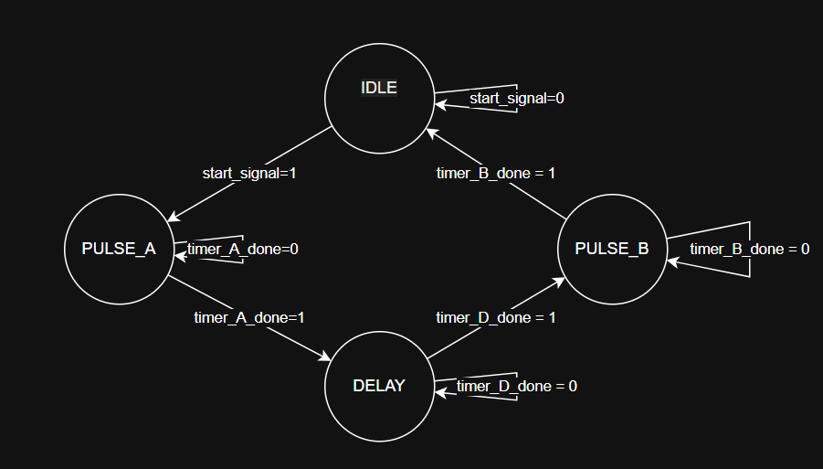
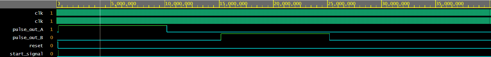

# FPGA_Pulse_Sequencer
A simple pulse sequencer built on a Xilinx Basys 3/Artix-7 FPGA, with software written in SystemVerilog.
The idea behind this is to simulate the control systems used in Quantum Technology experiments. It generates programmable digital pulses with nanosecond level timing accuracy.

## Architecture
The system is built on a FSM architecture that coordinates multiple independent timers.

* **Clock Speed:** 100 MHz (10ns period)
* **States:** `IDLE` -> `PULSE_A` -> `DELAY` -> `PULSE_B`
* **Modules:**
    * `sequencer_fsm.sv`: The central controller.
    * `clk_div.sv`: A parametric clock divider for precision timing.
    * `top_pulse_sequencer.sv`: Instantiates and wires the FSM controller to the three required timer instances.
    * `sequencer_tb.sv`: Testbench file use to generate the clock and verify the pulse sequence waveforms.

## Simulation & Testing
The core logic was verified using simulation (`sequencer_tb.sv`). The waveform confirms the FSM transitions are correct:

* **Pulse A:** HIGH for 10 $\mu s$ (10,000,000 ps)
* **Delay:** LOW for 5 $\mu s$
* **Pulse B:** HIGH for 10 $\mu s$

This waveform proves the FSM correctly manages the timers before synthesis begins.

## How to Run
1.  Open the project in Xilinx Vivado.
2.  Run the `sequencer_tb.sv` testbench for behavioral simulation.
3.  Generate Bitstream and target the Basys 3 board.