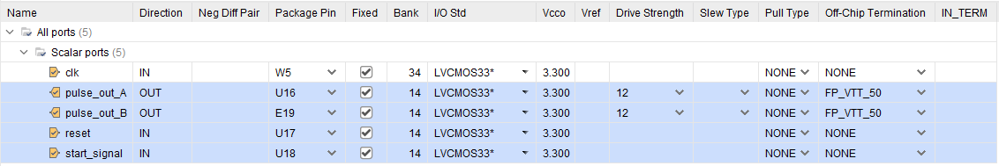
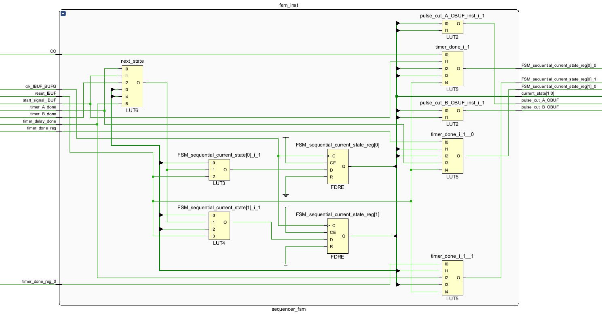
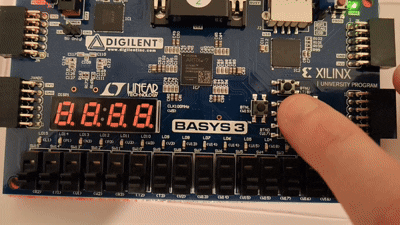

# FPGA_Pulse_Sequencer
A simple pulse sequencer built on a Xilinx Basys 3/Artix-7 FPGA, with software written in SystemVerilog.
The idea behind this is to simulate the control systems used in Quantum Technology experiments. It generates programmable digital pulses with nanosecond level timing accuracy.

## Architecture
The system is built on a FSM architecture that coordinates multiple independent timers.

* **Clock Speed:** 100 MHz (10ns period)
* **States:** `IDLE` -> `PULSE_A` -> `DELAY` -> `PULSE_B`
* **Modules:**
    * `sequencer_fsm.sv`: The central controller.
    * `clk_div.sv`: A parametric clock divider for precision timing.
    * `top_pulse_sequencer.sv`: Instantiates and wires the FSM controller to the three required timer instances.
    * `sequencer_tb.sv`: Testbench file use to generate the clock and verify the pulse sequence waveforms.

## Simulation & Testing
The core logic was verified using simulation (`sequencer_tb.sv`). The waveform confirms the FSM transitions are correct:

* **Pulse A:** HIGH for 10 $\mu s$ (10,000,000 ps)
* **Delay:** LOW for 5 $\mu s$
* **Pulse B:** HIGH for 10 $\mu s$

This waveform proves the FSM correctly manages the timers before synthesis begins.

Following this, the design was synthesized in Vivado for the Artix-7 (xc7a35tcpg236-1). The design I/O was constrained using a customized XDC file provided by Digilent (`Basys-3-Master.xdc`). The mappings were verified in the Vivado I/O Ports view to ensure all signals were assigned to the correct pins and configured for the LVCMOS33 (3.3V).

The synthesized netlist was inspected visually to confirm correct translation of the SystemVerilog code to hardware primitives. The FSM structure consists of D Flip Flops and LUT's as follows:

Finally, through implementation in Vivado the synthesis result was placed, routed to ensure sub 10 $ns$ timing, and the bit file was generated.

While physically testing, it was not possible for a human eye to identify the led pulses down to the $\mu s$ level. Two extra timing options were added to the `top_pulse_sequencer.sv` file for extra verification:

1. **1 Second Pulse and 0.5 Seond Delay** - For these timings it is possible to see the pulse and idle states in action.

2. **Very Short Pulse and Very Long Delay** - The FSM spends 99% of its time in the delay state, and so if working correctly both LED's should appear very dim. Otherwise, if the FSM is broken, LED A will be at full brightness.

## How to Run
1.  Open the project in Xilinx Vivado.
2.  Run the `sequencer_tb.sv` testbench for behavioral simulation.
3.  Synthesize, Implement and Generate Bitstream or use the one provided, and target the Basys 3 board.
4. On the physical board, click U17 to reset and hold U18 to start.